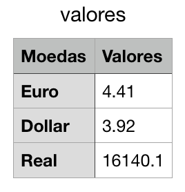

# Cambio com Python
Um script para pegar os valores, via requeisição web, das cotações das principais moedas mundiais:
  - Dollar
  - Euro
  - Bitcoin

API utilizada: [FIXER.IO](https://fixer.io/)

### Bibliotecas para Funcionamento do Script
```sh
pip install requests
```
```sh
pip install json
```
```sh
pip install panda
```
## Arquivo Gerado


### Desenvolvedor

 - Davi Paiva

License
----
*Free Software!* A Documentação está atualmente armazenada [aqui](https://github.com/davipmdpaiva/cambio-moedas)